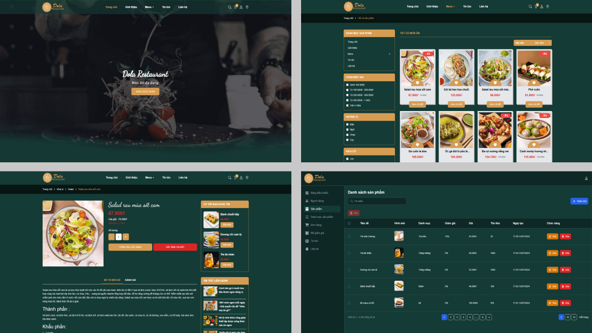

# Dola Restaurant

> Dola Restaurant là một ứng dụng web giúp quản lý nhà hàng, giúp khách hàng dễ dàng xem menu, đặt món, liên hệ với nhà hàng



## Mục lục

- [Công nghệ sử dụng](#công-nghệ-sử-dụng)
- [Chức năng](#chức-năng)
- [Cài đặt](#cài-đặt)
- [Sử dụng](#sử-dụng)
- [Tác giả](#tác-giả)
- [Giấy phép](#giấy-phép)

## Công nghệ sử dụng

- Frontend: React, Tailwind CSS, Redux Toolkit
- Backend: NodeJS, ExpressJS
- Database: MongoDB

## Chức năng

- Xác thực người dùng
  - Đăng ký
  - Đăng nhập
  - Đăng xuất
  - Quên mật khẩu
- Khách hàng
  - Xem thông tin cá nhân
  - Xem menu
  - Đặt món
  - Đổi mật khẩu
  - Liên hệ
- Admin
  - Quản lý món ăn
  - Quản lý người dùng
  - Quản lý đơn hàng
  - Quản lý liên hệ
  - Quản lý danh mục
  - Thống kê

## Cài đặt

1. Clone project về máy

```bash
git clone https://github.com/duc82/dola-restaurant.git
```

2. Cài đặt các thư viện cần thiết

- Frontend

  ```bash
  cd client
  npm install
  ```

- Backend

  ```bash
  cd server
  npm install
  ```

## Sử dụng

Thay đổi file `.env.example` thành `.env` và điền thông tin cần thiết

- Frontend

  ```bash
  cd client
  npm run dev
  ```

- Backend

  ```bash
  cd server
  npm run dev
  ```

## Tác giả

[duc82](https://github.com/duc82)

## Giấy phép

[MIT](MIT)
